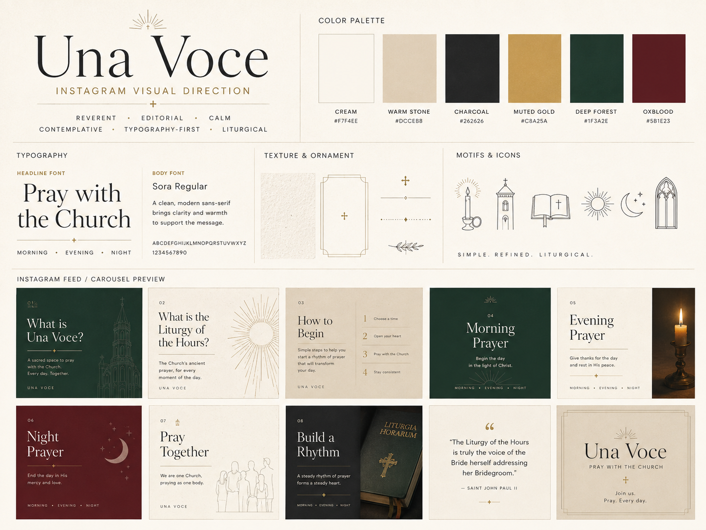

# Una Voce Instagram Visual Guide

This guide defines the approved editorial system for Una Voce social artwork.

**Status:** Approved social art-direction baseline  
**Related standard:** [Una Voce Editorial Standards](UNA_VOCE_EDITORIAL_STANDARDS.md)

Use this document as the source of truth for future social artwork. The approved first nine are the reference implementation of the system, not a temporary campaign experiment.

## Visual reference

## Direction

**Reverent · editorial · calm · contemplative · typography-first · liturgical**

The work should feel like a very good Catholic publication: part contemporary prayer book, part monastery noticeboard, and part high-end literary journal. It should remain warm, clear, and recognizably Una Voce.

The goal is cohesion without sameness.

## Core art-direction rule

The recurring Una Voce template elements are tools, not requirements.

Use the standard frame, number, cross mark, footer, and familiar title placement when they strengthen a composition. Leave some or all of them out when a stronger editorial idea calls for a different structure.

Roughly 25 to 35 percent of the artwork should visibly break the standard template. Across a carousel, vary scale, density, title placement, motif size, and use of negative space.

## What is fixed and what may evolve

### Preserve

- The approved palette and type families.
- The reverent, editorial, calm, contemplative, typography-first, and liturgical direction.
- The principle of cohesion without sameness.
- Legibility in 4:5 and 1:1 crops.
- Prayer framed as invitation rather than performance.
- The no-em-dash writing rule.

### Continue to explore

- Editorial layouts and scale contrast.
- New prayer-book, architectural, and diagrammatic motifs.
- Sparse marginalia.
- Carousel pacing.
- Rare, intentional real photography.
- Composition that breaks the standard frame when the idea benefits from it.

Do not return to a system in which every slide has the same frame, number, mark, footer, title position, and motif scale.

## Color palette

| Color | Hex | Use |
|---|---:|---|
| Cream | `#F7F4EE` | Primary paper field |
| Warm stone | `#DCCEB8` | Quiet editorial contrast |
| Charcoal | `#262626` | Type and deep neutral fields |
| Muted gold | `#C8A25A` | Rules, crosses, rays, and emphasis |
| Deep forest | `#1F3A2E` | Identity, morning, and ecclesial depth |
| Oxblood | `#5B1E23` | Night, solemnity, and selected emphasis |

Cream should remain prominent across the overall grid. Deep forest, charcoal, and oxblood act as anchors. Muted gold is a restrained detail rather than a broad luxury effect.

## Typography

### Headlines

Use **Cormorant Garamond** for post titles, quotations, the Una Voce name, and large editorial statements.

- Use regular weight with occasional italic emphasis.
- Use tight leading around `0.82` to `1.0`.
- Allow a short headline to fill most of the artboard when the idea deserves it.
- Create extreme scale contrast when useful: one giant word, a huge numeral, or a small centered line within a large field.
- Do not force every headline into the same position or width.

### Body and labels

Use **Sora** for supporting copy, indexes, metadata, captions, and interface text.

- Keep body copy large enough to read on a phone.
- Use uppercase labels with generous tracking.
- Let labels and marginalia establish an editorial world without competing with the message.

## Composition vocabulary

Use a mix of these structures across a carousel:

- Formal identity page with frame and architectural line work.
- Nearly full-artboard headline.
- Very sparse centered statement.
- Diagrammatic page.
- Large motif cropped beyond the edge.
- Typographic list treated as an image.
- Bottom-weighted or vertically aligned copy.
- Quiet invitation page with very little supporting material.

Do not repeat the same frame, number, mark, footer, title position, motif scale, and copy width on every slide.

## Texture and ornament

Use subtle warm-paper grain, fine rules, restrained gold, and sparse liturgical marks. Ornament should organize or bless the page. It should not fill every open space.

Possible micro-details include:

- `UNA VOCE / ONE VOICE`
- `LAUDS / MORNING PRAYER`
- `VESPERS / EVENING PRAYER`
- `COMPLINE / NIGHT PRAYER`
- `THE DAILY PRAYER OF THE CHURCH`
- `PSALMS · SCRIPTURE · HYMN · INTERCESSION`
- a tiny slide index
- vertical text along one edge
- a short Latin and English pairing when it genuinely helps

Use marginalia sparingly. It should make the page feel authored, not academic.

## Motif art

Motifs should feel like contemporary editorial engraving, prayer-book line work, liturgical diagrams, architectural drawings, or simplified devotional prints.

### Use

- Church tower or chapel architecture.
- Canonical Hours diagrams.
- Sunbursts, horizons, and crescent moons.
- Open prayer-book line art and ribbon marks.
- Repeated marks that suggest prayer through the day.
- Lines or architectural rhythms converging around a cross.
- Abstract representations of voices and the Church praying together.

### Avoid

- Cartoon or cute religious icons.
- Generic people illustrations.
- SaaS-style icon systems.
- Glossy simulated objects.
- Faux-real candles or books.
- Decorative complexity that disappears at phone size.

Motifs may be large, cropped beyond the canvas, repeated, or used as the primary visual anchor.

## Photography

Photography should remain rare. The feed must work without it.

A rough target is 80 to 90 percent typography, motif, ornament, and texture, with 10 to 20 percent real photography.

Good subjects include a real breviary, monastery window, candle, chapel detail, choir stall, stained glass crop, stone architecture, light in a church interior, or hands holding a prayer book.

Any photo-like concept placeholder must be visibly labeled in source or preview as one of the following:

- `[SOURCE REAL PHOTO]`
- `[PHOTO PLACEHOLDER]`
- `[REPLACE WITH REAL IMAGE]`

Never let a generated or simulated photo-like asset quietly become production artwork.

## Carousel pacing

A carousel should feel like turning pages in a short editorial feature.

A useful pacing pattern is:

1. Provocation.
2. Breathing room.
3. Explanation.
4. Visual moment.
5. Invitation.

Not every carousel needs exactly five slides. The principle is progression. Avoid building five cards with identical density and structure.

## Approved first nine

The launch sequence has three movements.

### Posts 1 to 3: Understand

1. What is Una Voce?
2. What is the Liturgy of the Hours?
3. No, you do not have to pray all seven.

### Posts 4 to 6: Begin

4. The easiest place to begin.
5. Morning Prayer, Evening Prayer, or Night Prayer?
6. There is more than one way to pray the Hours.

### Posts 7 to 9: Belong and Continue

7. What does it mean to pray with the whole Church?
8. What is a Devotion?
9. Prayer can become a rhythm.

Post 3 should feel bold and relieving. Post 7 should feel especially beautiful and ecclesial. Post 9 should feel quiet and reflective.

## Feed orientation

Instagram places newer posts before older posts. The studio renders the first nine in this visible order:

| Top row |  |  |
|---|---|---|
| Post 09 | Post 08 | Post 07 |
| Post 06 | Post 05 | Post 04 |
| Post 03 | Post 02 | **Post 01** |

**Post 01 is always the bottom-right tile** in the first-nine preview.

## Copy voice

The voice is clear, warm, grounded, confident, invitational, and occasionally surprising. It should be simple enough for newcomers without sounding cute, salesy, corporate, or generic.

The carousel can teach. The caption should sound like someone who deeply understands the Hours and wants to help another person enter them.

Avoid dense catechetical explanation, product language, excessive piety language, unverified partnership claims, and copy that treats prayer as content consumption or performance.

### No em dashes

Do not use em dashes anywhere in carousel copy, captions, UI text, documentation, or final-copy comments.

Use periods, commas, colons, semicolons, parentheses, or sentence breaks instead.

This is a standing Una Voce writing rule.

## Format, crop, and legibility

Master artwork is **1080 × 1350 px (4:5)**.

- Keep essential content at least 80 px from the horizontal edges.
- Keep every cover understandable in a centered 1080 × 1080 px crop.
- Keep important copy and motifs within the square crop safe area.
- Use strong contrast.
- Keep body type readable at Instagram scale.
- Keep motif lines heavy enough to survive phone rendering.
- Let decorative text remain secondary.

## HTML workflow

1. Run `npm run social`.
2. Review the visible first-nine grid in 4:5.
3. Confirm Post 01 is bottom right.
4. Switch to the 1:1 crop and verify every cover.
5. Open each post to review pacing, every slide, and the caption.
6. Edit campaign content in `social/designs.js`.
7. Edit artwork rules in `social/artwork.css`.
8. Edit the studio shell in `social/styles.css` only when the interface itself needs to change.

## Final review

Before approving a slide, ask:

1. Could this page plausibly belong in a beautiful contemporary Catholic journal or prayer book?
2. Does it still unmistakably feel like Una Voce?
3. Did this composition need every standard template element?

Then confirm:

- The feed feels cohesive without looking like nine copies of one template.
- Some slides are dramatically typographic.
- Some slides are dramatically motif-driven.
- Negative space is used confidently.
- Nothing feels gamified.
- Nothing feels like a generic Catholic Instagram template pack.
- Nothing feels like a SaaS product campaign.
- No em dashes appear in final copy.
- Every artwork remains legible in both 4:5 and 1:1 preview modes.
